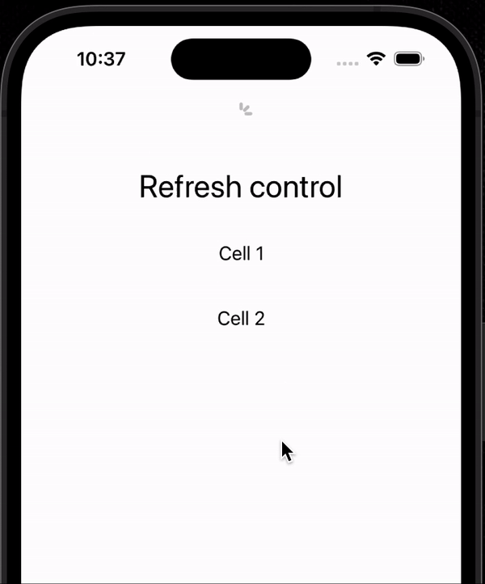

# Refreshable

<p align="center">
     
    
     
</p>

Library for marking any SwiftUI view as refreshable, similar to Apple's [```refreshable(action:)```](https://developer.apple.com/documentation/swiftui/view/refreshable(action:)) that available from iOS 15 and only in List 🤷🏼‍♂️.

You can use `Refreshable` with any view (e.g. LazyVStack). 

👨🏻‍💻 Feel free to subscribe to channel **[SwiftUI dev](https://t.me/swiftui_dev)** in telegram.

  <p align="center">
  
  </p>

## Requirements

Basically there is no any restriction to add this package to your project with minimum developments below iOS 14. 

But you can use `Refreshable` with views starting with **iOS 14**. 

Use `@available(iOS 14.0, *)` or `if #available(iOS 14, *)` for this one.

## Installation

#### Swift Package Manager

To integrate Refreshable into your project using SwiftPM add the following to your `Package.swift`:

```swift
dependencies: [
    .package(url: "https://github.com/c-villain/Refreshable", from: "0.1.0"),
],
```

or via [XcodeGen](https://github.com/yonaskolb/XcodeGen) insert into your `project.yml`:

```yaml
name: YourProjectName
options:
  deploymentTarget:
    iOS: 12.0
packages:
  Refreshable:
    url: https://github.com/c-villain/Refreshable
    from: 0.1.0
targets:
  YourTarget:
    type: application
    ...
    dependencies:
       - package: Refreshable
```

## Quick start

Basically there are two ways to mark your view as `Refreshable`.

<details>
  <summary>The easiest one is to add modifier `refreshable` to your view.</summary>
  
```swift
import Refreshable

struct YourView: View {
    
    var body: some View {
        ScrollView {
            LazyVStack {
                ...
            }
            .refreshable {
                // do your work on refresh here
            }
        }
    }
}

```

</details>

<details>
  <summary>Second one is to add manually `RefreshControl` to your view implementation. 
  Don't forget to name your view’s coordinate space!</summary>
  

```swift
import Refreshable

struct YourView: View {
    
    var body: some View {
        ScrollView {
            RefreshControl(coordinateSpace: .named("List")) { // <= HERE
                // do your work on refresh here
            }
            
            LazyVStack {
                ...
            }
        }
        .coordinateSpace(name: "List") // <= DON'T FORGET
    }
}
```

</details>

## Communication

- If you **found a bug**, open an issue or submit a fix via a pull request.
- If you **have a feature request**, open an issue or submit a implementation via a pull request or hit me up on **lexkraev@gmail.com** or **[telegram](https://t.me/lexkraev)**.
- If you **want to contribute**, submit a pull request onto the master branch.

## License

Refreshable package is released under an MIT license.
